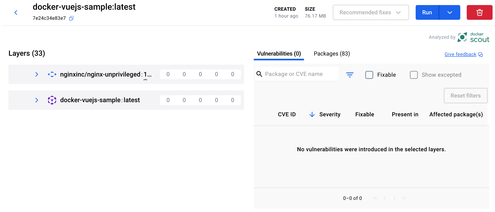

# Docker Vue.js Sample Project

This project demonstrates how to effectively containerize a modern Vue.js application using Docker for both **development** and **production** workflows.

It is used as part of the [official Docker Vue.js sample guide](https://docs.docker.com/guides/vuejs/), showcasing industry best practices for front-end containerization—including secure builds, streamlined development workflows, and optimized production delivery.

**Author**

- [Kristiyan Velkov](https://www.linkedin.com/in/kristiyan-velkov-763130b3/)
- [Blog - Medium](https://medium.com/@kristiyanvelkov)
- [Front-end World Newsletter](https://kristiyanvelkov.substack.com)

---

## Security

This Docker image has been thoroughly scanned for vulnerabilities to ensure a secure environment for your Vue.js application. The image has passed all vulnerability assessments using Docker's built-in security tools, including Docker Scout. Regular updates to the base image and dependencies are recommended to maintain a high level of security.

  

---

### 📌 Contribution

Contributions are always welcome, whether it's reporting issues, improving documentation, fixing bugs, or adding new features. This project is for everyone! 💙
And yes, it's open-source! 🎉

---

### 📬 Contact

Feel free to reach out to me on [LinkedIn](https://www.linkedin.com/in/kristiyan-velkov-763130b3/) or [Medium](https://medium.com/@kristiyanvelkov).

---

### ☕ Support My Work

If you find my work helpful and would like to support me, consider donating via:

- [Revolut](https://revolut.me/kristiyanvelkov)
- [Buy Me a Coffee](https://www.buymeacoffee.com/kristiyanvelkov)
- [GitHub Sponsors](https://github.com/sponsors/kristiyan-velkov)

Your support helps me continue creating valuable content for the community. Thank you! 🚀

---

### License

This project is licensed under the MIT License.
